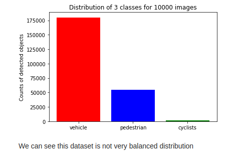

# Object Detection in an Urban Environment

## Project overview

Object detection technique is one of the imperative system for autonomous driving. Accurately detecting the surrounding objects can help autonomous vehicles react and prevent potential collisions. In this project, we use deep learning approaches to detect objects in urban environments. The [Waymo Open dataset](https://waymo.com/open/), which provides rich and yet various driving scenes, will be used to train our neural network models. We first analyze the data in Waymo Open dataset and split the data into training, validation and test sets based on the cross-validation method. And we perform the training and further improve the model with different strategies. 

## Dataset

### Dataset analysis

As a first step we need to [download and process the dataset](README.md#download-and-process-the-data) to get necessary information for object detections in camera images. "tfrecord" format contains the image being resized to 640x640 and the bounding box information. The function of randomly displaying 10 images, as shown below, is implemented to check whether the image associated its corresponding bounding boxes and class labels are presented correctly.

As a second step, we take 10000 images from dataset for analyzing the the number of objects for each class, the number of bounding boxes, etc.  

In the image shown below, we can see data distribution amon the classes are not evenly distributen. This can be because of there will be more number of `cars` than `pedestrian` and `cyclist` in the urban scenario. The total number of `pedestrian` and `cyclist` for this training a model may not be sufficient.

### Cross validation

Waymo open dataset have similar characteristics (number of object for each class, images taken in the daytime/at night and so on), we [split those images](./create_splits.py) in the same group. Here split the data into training, validation and test sets. More specifically, 75% for training, 15% for validation and 10% for test. Each set has its own folder containing its corresponding images split from the processed Waymo open data. 

## Training

### Reference experiment (Experiment)

We perform the transfer learning using [SSD_ResNet50 model](http://download.tensorflow.org/models/object_detection/tf2/20200711/ssd_resnet50_v1_fpn_640x640_coco17_tpu-8.tar.gz) with the [default pipeline configuration](./Object-Detection-Urban-env/pipeline.config). 
