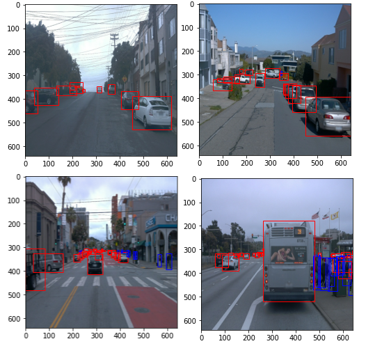
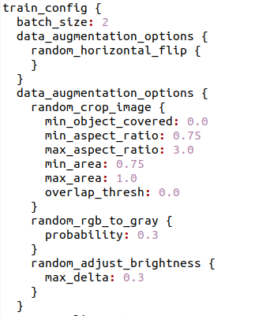
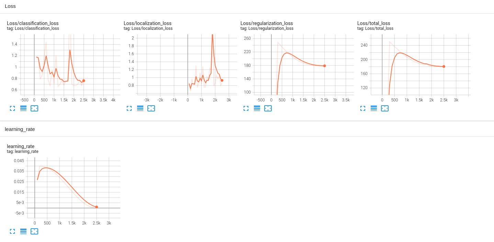
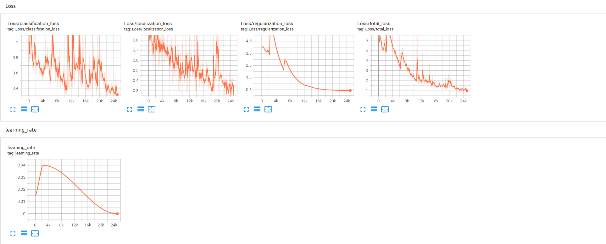

# Object Detection in an Urban Environment

## Project overview

Object detection technique is one of the imperative system for autonomous driving. Accurately detecting the surrounding objects can help autonomous vehicles react and prevent potential collisions. In this project, we use deep learning approaches to detect objects in urban environments. The [Waymo Open dataset](https://waymo.com/open/), which provides rich and yet various driving scenes, will be used to train our neural network models. We first analyze the data in Waymo Open dataset and split the data into training, validation and test sets based on the cross-validation method. And we perform the training and further improve the model with different strategies. 

## Dataset

### Dataset analysis

As a first step we need to [download and process the dataset](README.md#download-and-process-the-data) to get necessary information for object detections in camera images. "tfrecord" format contains the image being resized to 640x640 and the bounding box information. The `display_instances´ is the function for randomly displaying 10 images with shuffle func. usage, as shown below, is implemented to check whether the images are associated with their corresponding bounding boxes and class labels are presented correctly.

As a second step, we take 10000 images from dataset for analyzing the the number of objects for each class, the number of bounding boxes, etc.  

In the image shown below, we can see data distribution amon the classes are not evenly distributen. This can be because of there will be more number of `cars` than `pedestrian` and `cyclist` in the urban scenario. The total number of `pedestrian` and `cyclist` for this training a model may not be sufficient.

### Cross validation

Waymo open dataset have similar characteristics (number of object for each class, images taken in the daytime/at night and so on), we [split those images](./create_splits.py) in the same group. Here split the data into training, validation and test sets. More specifically, 75% for training, 15% for validation and 10% for test. Each set has its own folder containing its corresponding images split from the processed Waymo open data. 

## Training

### Reference experiment (Experiment)

We perform the transfer learning using [SSD_ResNet50 model](http://download.tensorflow.org/models/object_detection/tf2/20200711/ssd_resnet50_v1_fpn_640x640_coco17_tpu-8.tar.gz) with the default `pipeline.config` as an intitail experiment with no modification made to data augumentation options as shown in the image below. 

#### Experiment 2

The processing operations on images are added in data augmentation 

* Convert the rgb image to the gray image
* Randomly adjust image brightness
* Randomly change hue value
* Randomly change saturation with the defined range

### Discussion

There are some other options in pipeline_config that may potentially improve the model. Since, the class labels and images taken in different conditions (rain, fog, night time) are not balanced. It will be nice to have more diverse sets of data for training data. Additionally, some of the ground truth bounding boxes in Waymo Data are quite small, which nearly cannot be perceived by human eye for exploratory data analysisdata confirmation.

## Results

The images below shows the different trainings and evaluations. Overall, the training and validation loss of augmented model are decreased in comparison with the losses of reference model. Better model performance is observed in the precison and recall curve. The model performance can be improved by using further measures, such as tuning optimization parameter or using other pretrained neural network as baseline. Moreover, the imbalance of classes has to be made by adding more samples of pedestrians and cyclists. The improvement of dataset plays an important role in the loss curves and bring better classification performance.

After the trained model is exported, we can perform object detection with the model on driving scenes stored in the test set using Animations.gif or animations.mp4. Thus the object detection results are shown in the video. 

